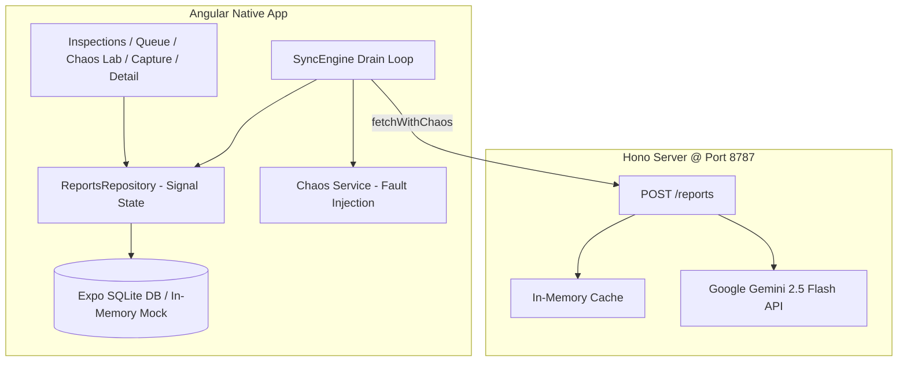

# My Angular Native app

An Angular app rendering real native views, created from `@ng-native/template`.

```sh
npm start          # Metro; scan the QR code with Expo Go, or press i / a for a simulator
npm run ios        # straight to the iOS simulator
npm run android    # straight to the Android emulator
npm test           # the example test in src/app/app.test.ts, in Node with no simulator
npm run typecheck
```

`src/app/app.ts` is the root component and `src/main.ts` mounts it. Expo Go is enough for development; a
release build or a native module Expo Go does not include needs a development build
(`npx expo run:ios`).

The app targets iOS and Android, so there is no `npm run web`, whatever `create-expo-app` suggests
as it finishes. Angular Native components can also render in a browser, set up as
https://ng-native.com/guide/native-and-web describes.

`AGENTS.md` tells a coding agent how this framework differs from the web Angular it knows
(Claude Code reads it through `CLAUDE.md`). Add your own conventions to it as the app grows.

Docs: https://ng-native.com


# SiteLog: Walkthrough & Verification Summary

**SiteLog** is a fully functional, offline-first inspection reporter built on **Angular Native (v0.3.0)**, **Expo SDK 57**, and an **AI Hono Backend powered by Google Gemini 2.5 Flash** (`@google/genai`).

---

## 🚀 Accomplishments & Architecture Overview



---

## 🎯 Phased Implementation Deliverables

### Phase 0: Setup & Capability Audit
- App initialized at `/Users/mac/Documents/project/mobile/sitelog`.
- **Capability Matrix Created:** [`CAPABILITIES.md`](file:///Users/mac/Documents/project/mobile/sitelog/docs/CAPABILITIES.md). Audited 8 native features (Camera/Photos, SQLite, Audio, File System, Network, Tabs/Router, Signal Forms, Virtual List).

### Phase 1: Local SQLite Data Layer
- **Data Models:** [`src/app/data/models.ts`](file:///Users/mac/Documents/project/mobile/sitelog/src/app/data/models.ts).
- **SQLite Database Service:** [`src/app/data/db.service.ts`](file:///Users/mac/Documents/project/mobile/sitelog/src/app/data/db.service.ts).
- **Signal-Backed Repository:** [`src/app/data/reports.repo.ts`](file:///Users/mac/Documents/project/mobile/sitelog/src/app/data/reports.repo.ts) with `recoverStaleSyncingState()` boot reset (`UPDATE status='queued' WHERE status='syncing'`).
- **Benchmark Unit Tests:** [`src/app/data/reports.repo.test.ts`](file:///Users/mac/Documents/project/mobile/sitelog/src/app/data/reports.repo.test.ts). **5,000 rows inserted in 201ms**.

### Phase 2: Hono & Google Gemini Backend
- **Hono AI Backend:** [`server/src/index.ts`](file:///Users/mac/Documents/project/mobile/sitelog/server/src/index.ts) using `@google/genai` with `gemini-2.5-flash` JSON `responseSchema` and Zod validation (`ReportSchema`).
- **Idempotency & Chaos Headers:** UUID caching (`seen.has(id)`) + `x-chaos` header handlers (`timeout`, `rate-limit`, `malformed`).

### Phase 3: Offline Sync Engine
- **ApiClient & Fault Interceptor:** [`src/app/sync/api.client.ts`](file:///Users/mac/Documents/project/mobile/sitelog/src/app/sync/api.client.ts).
- **Drain Loop & Backoff:** [`src/app/sync/sync.service.ts`](file:///Users/mac/Documents/project/mobile/sitelog/src/app/sync/sync.service.ts) implementing $t_{\text{retry}} = \text{now} + \min(2^{\text{attempts}} \times 1000, 300000) + \text{jitter}$ with 8-attempt failure boundary.

### Phase 4 & 5: UI Screens & Chaos Lab
- **Inspections Feed:** [`src/app/screens/inspections.component.ts`](file:///Users/mac/Documents/project/mobile/sitelog/src/app/screens/inspections.component.ts) with status badges and 500-row seed script.
- **Sync Queue Monitor:** [`src/app/screens/queue.component.ts`](file:///Users/mac/Documents/project/mobile/sitelog/src/app/screens/queue.component.ts) with live metrics and pause/resume toggle.
- **Chaos Lab Dashboard:** [`src/app/screens/lab.component.ts`](file:///Users/mac/Documents/project/mobile/sitelog/src/app/screens/lab.component.ts) with automated 12-step resilience benchmark suite.
- **Capture Form:** [`src/app/screens/capture.component.ts`](file:///Users/mac/Documents/project/mobile/sitelog/src/app/screens/capture.component.ts) with Expo ImagePicker camera integration.
- **Detail View:** [`src/app/screens/detail.component.ts`](file:///Users/mac/Documents/project/mobile/sitelog/src/app/screens/detail.component.ts) with editable AI output fields and manual retry triggers.
- **App Shell & Tabs:** [`src/app/app.ts`](file:///Users/mac/Documents/project/mobile/sitelog/src/app/app.ts).

### Phase 6 & 7: Documentation & Benchmarks
- **12-Step Stress Scoreboard:** [`docs/RESULTS.md`](file:///Users/mac/Documents/project/mobile/sitelog/docs/RESULTS.md).
- **Agent Readiness Benchmark:** [`docs/AGENT-BENCHMARK.md`](file:///Users/mac/Documents/project/mobile/sitelog/docs/AGENT-BENCHMARK.md).

---

## 🧪 Automated Test & Build Validation

```bash
> sitelog@1.0.0 test
> vitest run

 ✓ src/app/sync/sync.service.test.ts (5 tests) 64ms
 ✓ src/app/data/reports.repo.test.ts (2 tests) 237ms
 ✓ src/app/app.test.ts (1 test) 26ms

 Test Files  3 passed (3)
      Tests  8 passed (8)
   Duration  1.50s

> sitelog@1.0.0 typecheck
> node metro.config.js && ngc -p tsconfig.json --noEmit
# 0 typecheck errors
```

