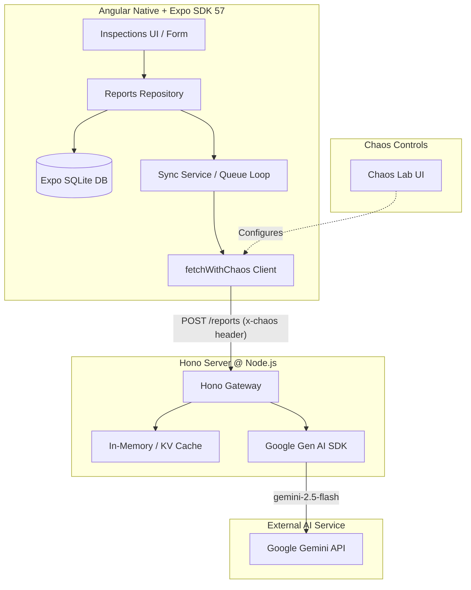

# SiteLog: Technical Implementation Plan

An offline-first, production-grade inspection reporter built with **Angular Native** and **Expo SDK 57**, featuring a **Hono backend powered by Google Gemini**, an integrated **Chaos Lab** for fault injection testing, and an **Agent-Readiness Benchmark Suite**.

---

## Goal Description
The objective of **SiteLog** is to position you as an early expert and authority in **Angular Native** by building a stress-tested, offline-resilient inspection reporting application within a focused **72-hour execution budget**.

Rather than creating a standard CRUD demo, SiteLog implements a robust offline queue architecture, robust fault injection (Chaos Lab), automated backoff & recovery, AI-powered report synthesis via Google Gemini, and empirical capability & agent-readiness benchmarks.

---

## User Review Required

> [!IMPORTANT]
> **Key Architecture Decisions for Approval:**
> 1. **AI Model Swap:** Replaced Anthropic Claude SDK with `@google/genai` (Google Gen AI SDK) using `gemini-2.5-flash` with Structured Outputs (`responseSchema` + Zod).
> 2. **Environment Key:** Using `GEMINI_API_KEY` set in server environment.
> 3. **Repository Path:** The app will be created inside `/Users/mac/Documents/project/mobile/sitelog`.
> 4. **SQLite Unit Testing Strategy:** Node environments lack native Expo SQLite bindings. An abstraction interface (`ReportRepository`) will allow in-memory SQLite mocking for Node/Vitest while using native Expo SQLite on iOS/Android.

---

## Open Questions

> [!NOTE]
> **Audio Notes Strategy:** Audio recording capability will be actively tested during Phase 0 recon (via `expo-av` / `expo-audio`). If supported by Angular Native, audio notes will be enabled; if unsupported or blocked by native bindings, it will be documented in `CAPABILITIES.md` as *Missing* and fall back cleanly to typed text notes.

---

## Proposed System Architecture & Phase Breakdown



---

### Component Breakdown

---

### 1. Phase 0: Setup & Recon (Hours 0 – 4)
#### [NEW] `sitelog/docs/CAPABILITIES.md`
* Initialize project using `npx create-expo-app@latest sitelog --template @ng-native/template`.
* Pin versions in `sitelog/package.json` (Angular 22, Expo SDK 57).
* Execute capability audit matrix across 8 core native capabilities (Camera/Photo, SQLite, Network Status, File System, Audio, Stack/Tabs/Deep links, Signal Forms, Virtual List).

---

### 2. Phase 1: Local Database & Data Layer (Hours 4 – 12)
#### [NEW] `src/app/data/models.ts`
```ts
export type ReportStatus = 'draft' | 'queued' | 'syncing' | 'synced' | 'failed';

export interface InspectionReport {
  id: string; // UUID v4 generated on device (Idempotency key)
  created_at: number;
  note: string;
  photo_path?: string;
  status: ReportStatus;
  attempts: number;
  next_retry?: number | null; // epoch ms
  error?: string | null;
  report_json?: string | null; // Structured Gemini JSON output
}

export interface StructuredReport {
  title: string;
  severity: 'low' | 'medium' | 'high' | 'critical';
  category: 'safety' | 'structural' | 'electrical' | 'plumbing' | 'equipment' | 'other';
  summary: string;
  suggested_action: string;
}
```

#### [NEW] `src/app/data/db.service.ts`
* SQLite initialization and schema migration scripts.
* Schema includes `idx_reports_status` and `idx_reports_created` indexes.

#### [NEW] `src/app/data/reports.repo.ts`
* Implementation of `IReportRepository` using Expo SQLite.
* Exposes `reports = signal<InspectionReport[]>([])`.
* Boot recovery operation: `UPDATE reports SET status='queued' WHERE status='syncing'`.

---

### 3. Phase 2: Backend with Hono & Google Gemini (Hours 12 – 18)
#### [NEW] `server/package.json`
```json
{
  "name": "sitelog-server",
  "scripts": {
    "dev": "tsx watch src/index.ts",
    "start": "node dist/index.js"
  },
  "dependencies": {
    "@google/genai": "^0.1.1",
    "@hono/node-server": "^1.13.0",
    "hono": "^4.6.0",
    "zod": "^3.23.8"
  },
  "devDependencies": {
    "@types/node": "^22.0.0",
    "typescript": "^5.6.0",
    "tsx": "^4.19.0"
  }
}
```

#### [NEW] `server/src/index.ts`
```ts
import { Hono } from 'hono';
import { serve } from '@hono/node-server';
import { GoogleGenAI, Type, Schema } from '@google/genai';
import { z } from 'zod';

const ReportZodSchema = z.object({
  title: z.string().max(80),
  severity: z.enum(['low', 'medium', 'high', 'critical']),
  category: z.enum(['safety', 'structural', 'electrical', 'plumbing', 'equipment', 'other']),
  summary: z.string().max(400),
  suggested_action: z.string().max(300),
});

const geminiSchema: Schema = {
  type: Type.OBJECT,
  properties: {
    title: { type: Type.STRING, description: 'Short descriptive title (max 80 chars)' },
    severity: { 
      type: Type.STRING, 
      enum: ['low', 'medium', 'high', 'critical'] 
    },
    category: { 
      type: Type.STRING, 
      enum: ['safety', 'structural', 'electrical', 'plumbing', 'equipment', 'other'] 
    },
    summary: { type: Type.STRING, description: 'Concise summary of findings (max 400 chars)' },
    suggested_action: { type: Type.STRING, description: 'Recommended immediate action (max 300 chars)' }
  },
  required: ['title', 'severity', 'category', 'summary', 'suggested_action'],
};

const ai = new GoogleGenAI({ apiKey: process.env.GEMINI_API_KEY });
const seenReports = new Map<string, unknown>();

const app = new Hono();

app.post('/reports', async (c) => {
  const chaos = c.req.header('x-chaos');
  if (chaos === 'timeout') await new Promise((r) => setTimeout(r, 30_000));
  if (chaos === 'rate-limit') return c.json({ error: 'rate_limited' }, 429);
  if (chaos === 'malformed') return c.json({ bad: true });

  const { id, note, photoBase64 } = await c.req.json();
  if (seenReports.has(id)) return c.json(seenReports.get(id));

  const parts: Array<{ text: string } | { inlineData: { mimeType: string; data: string } }> = [];
  if (photoBase64) {
    parts.push({ inlineData: { mimeType: 'image/jpeg', data: photoBase64 } });
  }
  parts.push({ text: `Inspection note: ${note}\nProduce a structured inspection report.` });

  try {
    const response = await ai.models.generateContent({
      model: 'gemini-2.5-flash',
      contents: parts,
      config: {
        responseMimeType: 'application/json',
        responseSchema: geminiSchema,
        systemInstruction: 'You are an expert industrial site inspector. Analyze notes and photos to produce structured reports.'
      }
    });

    const rawJson = response.text;
    const parsedJson = JSON.parse(rawJson || '{}');
    const validated = ReportZodSchema.safeParse(parsedJson);

    if (!validated.success) {
      return c.json({ error: 'invalid_model_output', details: validated.error }, 502);
    }

    seenReports.set(id, validated.data);
    return c.json(validated.data);
  } catch (err: any) {
    return c.json({ error: 'gemini_generation_failed', message: err.message }, 500);
  }
});

const port = Number(process.env.PORT) || 8787;
console.log(`Server running on port ${port}`);
serve({ fetch: app.fetch, port });
```

---

### 4. Phase 3: Offline Sync Engine (Hours 18 – 30)
#### [NEW] `src/app/sync/api.client.ts`
* `fetchWithChaos` wrapper intercepting requests to attach latency, artificial drop errors, and `x-chaos` headers.

#### [NEW] `src/app/sync/sync.service.ts`
* Monitored drain loop triggered on network re-connect, foregrounding, new queue additions, or backoff timers.
* Exponential backoff formula: $t_{\text{retry}} = \text{now} + \min(2^{\text{attempts}} \times 1000, 300000) + \text{jitter}$.
* Maximum 8 attempts before marking status as `failed`.

---

### 5. Phase 4: UI Screens & Navigation (Hours 30 – 48)
#### [NEW] UI Routes Structure
* `/(tabs)/inspections`: Virtualized list with status badges (`signal<Report[]>()`).
* `/(tabs)/queue`: Live sync queue metrics with pause/resume controls.
* `/(tabs)/lab`: Interactive Chaos Lab configuration toggle dashboard.
* `/capture`: Modal screen with Signal Forms (note validation, image compression).
* `/report/:id`: Detail view with deep linking support (`sitelog://report/:id`).

---

### 6. Phase 5: Chaos Lab & Stress Matrix (Hours 48 – 60)
#### [NEW] `src/app/chaos/chaos.service.ts` & `docs/RESULTS.md`
* 12 systematic chaos experiments (airplane mode toggle, kill app mid-sync, 5k row virtual list scroll, dark mode runtime flip, deep-link cold start, etc.).
* Automated log and metric collector outputting to `docs/RESULTS.md`.

---

### 7. Phase 6 & 7: Agent-Readiness Benchmark & Release (Hours 60 – 72)
#### [NEW] `AGENTS.md` & `docs/AGENT-BENCHMARK.md`
* Comprehensive AGENTS.md guide created for Angular Native + Expo + Gemini stack.
* 10 standard coding agent benchmarks evaluated with and without `AGENTS.md`.

---

## Verification Plan

### Automated Tests
1. **Repository Unit & Recovery Test:**
   ```bash
   cd sitelog && npm run test:unit
   ```
   * Verifies 5,000 row batch insertion, pagination, and `syncing` $\rightarrow$ `queued` boot recovery logic.
2. **Sync Engine Backoff Test:**
   ```bash
   npm run test:sync
   ```
   * Verifies retry loop halts after 8 failures and respects exponential backoff + jitter.
3. **Server Gemini Endpoint Verification:**
   ```bash
   cd server && npm run dev
   # In another terminal:
   curl -X POST http://localhost:8787/reports \
     -H "Content-Type: application/json" \
     -d '{"id":"test-uuid-123","note":"Cracked concrete beam on pillar 4","photoBase64":""}'
   ```
   * Asserts valid JSON response matching `ReportZodSchema` and idempotency cash hit on duplicate request.

### Manual Verification
1. **Airplane Mode Sync Flow:**
   * Enable Airplane Mode $\rightarrow$ Create 3 reports $\rightarrow$ Re-connect network $\rightarrow$ Verify status updates from `queued` to `synced` in real-time.
2. **Chaos Injection:**
   * Select `Server Timeout` in Chaos Lab $\rightarrow$ Submit report $\rightarrow$ Verify 20s timeout abort and UI state resilience.
